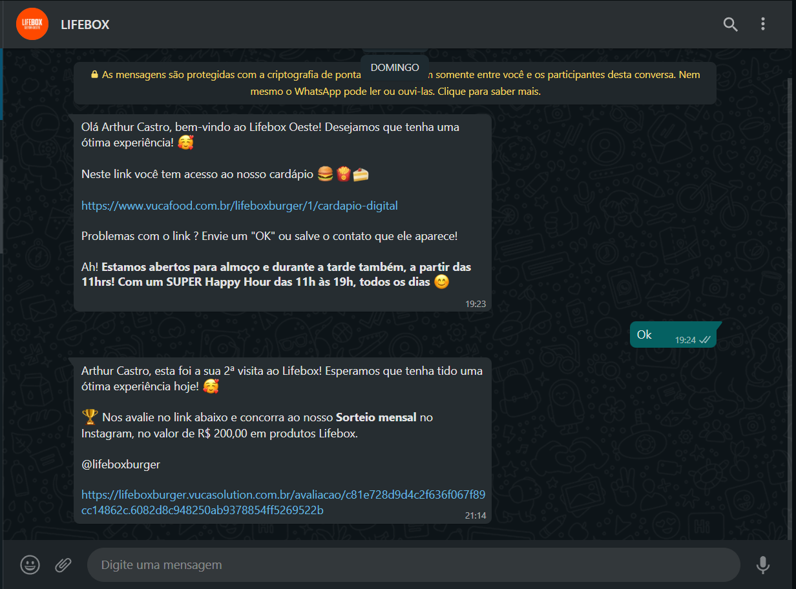

# Universidade Federal de Goiás

## Instituto de Informática

**Graduandos**:
 
201808801 - Arthur Castro da Cunha Lopes 
201808795 - Felipe Lagares 
201802758 - Christopher Oliveira 
201910890 - Joyce Beatriz Ferreira da Costa Silva 
 
**Disciplina**: Domínios de Software 
**Curso**: Engenharia de Software 
**Professor responsável**: Jacson Rodrigues Barbosa

# Estudo de caso WPTrack

## Problemática:

Muitas empresas não sabem, quantitativamente, o quão satisfeitos (ou insatisfeitos) seus clientes estão com a qualidade da prestação de serviço oferecida por seus colaboradores. Com isso em mente, vamos desenvolver uma aplicativo que facilite a obtenção de feedback dos clientes, proporcionando a interação empresa-cliente pelo e-mail e também através da rede social WhatsApp.

Esse grupo de estudantes acreditam que vários benefícios poderiam ser obtidos com um sistema **WPTrack**, como por exemplo:

- As empresas vão ter, quantitativamente, conhecimento sobre a qualidade da sua prestação de serviços.
- Os clientes terão a oportunidade de passar um feedback de maneira fácil e rápida.

#### Pessoas-chave:

- Paulo (Posê Beleza)
- Recepcionista (caso de empresa que presta serviço)

#### Avaliação de Impacto:

**_As empresas que prestam serviço_**: a recepcionista de cada loja será responsável por enviar o pedido de feedback para cada cliente.
**_As empresas de transporte_**: será adicionado no processo de envio de notificações, o envio do pedido de feedback.

#### Requisitos:

1. Eu, como recepcionista, preciso entrar no sistema com meus dados de login, para poder começar a enviar os pedidos de feedback.
2. Eu, como recepcionista, preciso registrar o nome e número de telefone com WhatsApp do cliente, para que o pedido de feedback seja entregue através do e-mail ou WhatsApp dele.
3. Eu, como cliente, gostaria de clicar no link do pedido de feedback para registrar meu nível de satisfação com o serviço prestado pela empresa.

#### Protótipos

**App do agente**: Leia o QRCode em um celular para abrir o web app.

**Dashboard**:
https://www.figma.com/file/T4bgnuf9p3DAkKsViWf2WC/Figma-Admin-Dashboard-UI-Kit-Community?node-id=0%3A1

### Inspiração:

#### TRACK

TRACK é uma empresa que possui diversos serviços e soluções em gestão de clientes e otimizações de pesquisas.

https://track.co/

##### LIFEBOX

Exemplo de notificação no WhatsApp na vida real:

## Coleta e Escrita de Requisitos

#### NECESSIDADES GERAIS

| DESCRIÇÃO                                                                                                        | FONTE                                                    |
| ---------------------------------------------------------------------------------------------------------------- | -------------------------------------------------------- |
| Obter feedback dos clientes sobre a sua prestação de serviços                                                    | Empresa da área de beleza e estética                     |
| Enviar pedido de feedback através do web app                                                                     | Recepcionista                                            |
| Fornecer feedback sobre a sua experiência com a empresa                                                          | Cliente                                                  |
| Personalizar mensagem que é enviada para o cliente solicitando o feedback por canal. Exemplo: e-mail e WhatsApp. | Empresa da área de beleza e estética                     |
| Configurar as unidades da empresa                                                                                | Administrador da conta da empresa na plataforma WP Track |
| Configurar os recepcionistas de cada unidade (pessoas que vão solicitar o feedback para o cliente)               | Administrador da conta da empresa na plataforma WP Track |
| Configurar os serviços prestados                                                                                 | Administrador da conta da empresa na plataforma WP Track |
| Filtrar relatório por unidade                                                                                    | Empresa da área de beleza e estética                     |
| Filtrar relatório por serviço                                                                                    | Empresa da área de beleza e estética                     |
| Filtrar relatório por período                                                                                    | Empresa da área de beleza e estética                     |

### ENTIDADES ENVOLVIDAS

- Dono do negócio de prestação de serviços
- Cliente
- Recepcionistas
- Profissionais da área da beleza (Cabeleireiro, manicure...)
- Administrador

### MECANISMOS DE COLETA DE REQUISITOS ENVOLVIDOS

- Dono do negócio de prestação de serviços: entrevista online através do Meet.
- Cliente: gravação da tela do app e telemetria
- Recepcionistas: entrevista online ou presencial, gravação da tela do app e telemetria

# REQUISITOS FUNCIONAIS e NÃO FUNCIONAIS:

Estamos trabalhando com uma metodologia mais ágil e decidimos escrever os requisitos em formatos de [histórias de usuário](./user-stories.md "Histórias de usuário").
