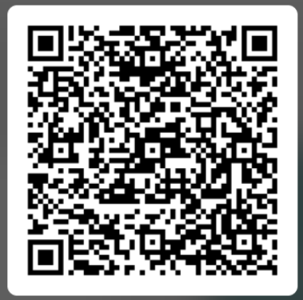
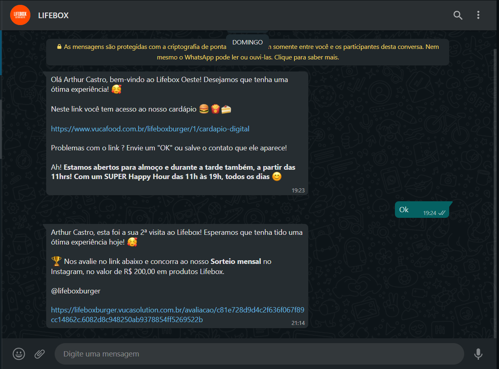

# Universidade Federal de Goiás

## Instituto de Informática

**Disciplina**: Domínios de Software
**Curso**: Engenharia de Software
**Professor responsável**: Jacson Rodrigues Barbosa

# Estudo de caso WPTrack

## Problemática:

Muitas empresas não sabem, quantitativamente, o quão satisfeitos (ou insatisfeitos) seus clientes estão com a qualidade da prestação de serviço oferecida por seus colaboradores. Com isso em mente, vamos desenvolver uma aplicativo que facilite a obtenção de feedback dos clientes, proporcionando a interação empresa-cliente pelo e-mail e também através da rede social WhatsApp.

Esse grupo de estudantes acreditam que vários benefícios poderiam ser obtidos com um sistema **WPTrack**, como por exemplo:

- As empresas vão ter, quantitativamente, conhecimento sobre a qualidade da sua prestação de serviços.
- Os clientes terão a oportunidade de passar um feedback de maneira fácil e rápida.

#### Pessoas-chave:

- Paulo (Posê Beleza)
- Recepcionista (caso de empresa que presta serviço)

#### Avaliação de Impacto:

**_As empresas que prestam serviço_**: a recepcionista de cada loja será responsável por enviar o pedido de feedback para cada cliente.
**_As empresas de transporte_**: será adicionado no processo de envio de notificações, o envio do pedido de feedback.

### Protótipos

**App do agente**: Leia o QRCode em um celular para abrir o web app.

**Dashboard**:
https://www.figma.com/file/T4bgnuf9p3DAkKsViWf2WC/Figma-Admin-Dashboard-UI-Kit-Community?node-id=0%3A1

### Inspiração:

##### LIFEBOX

Exemplo de notificação no WhatsApp na vida real:

